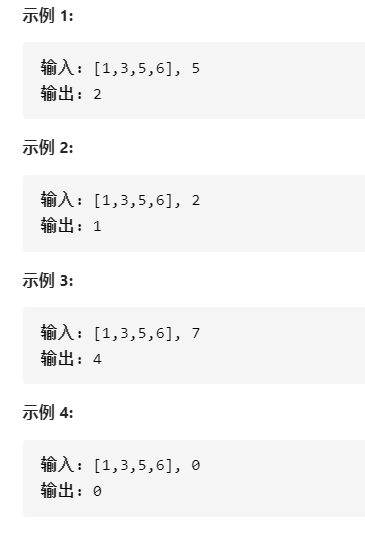

### 搜索插入位置

给定一个排序数组和一个目标值，在数组中找到目标值，并返回其索引。如果目标值不存在于数组中，返回它将会被按顺序插入的位置。假设数组中无重复元素。

- 

- 解答

  二分查找

  ```java
  class Solution {
      public int searchInsert(int[] nums, int target) {
          int left=0;
          int right=nums.length-1;
          int mid;
          if(target == nums[left])return left;
          if(target == nums[right])return right;
          if(target < nums[left])return 0; 
          if(target>nums[right])return right+1;
          while(left<=right){
              mid = (left+right)/2;
              if(target == nums[mid])return mid;
              else if(target>nums[mid]){
                  if(target<nums[mid+1])return mid+1;//在mid的右边，同时小于于mid的右边一个，所以target应插入在mid之后
                  left = mid + 1;
              }else if(target<nums[mid]){
                  if(target>nums[mid-1])return mid;//在mid左边，并且大于mid左边一个，所以target应插入在mid对应的数的左边（在mid的处插入）
                  right = mid - 1;
              }
          }
          return -1;
      }
  }
  ```

  

作者：力扣 (LeetCode)
链接：https://leetcode-cn.com/leetbook/read/array-and-string/yf47s/
来源：力扣（LeetCode）

