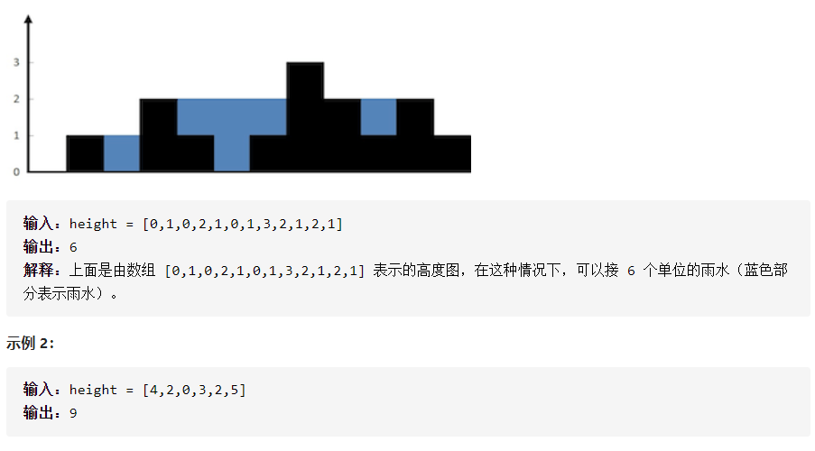

## 42.接雨水



```java
class Solution {
    
    public int trap(int[] height) {
        Stack<Integer> s = new Stack<Integer>();
        int n = height.length;
        int[] left = new int[n];//当前索引，对应的
        int[] right = new int[n];
        for(int i = 0; i < n; i++){
            left[i] = -1;
            right[i] = -1;
        }
        //维护一个单调递减栈，栈、left、right 存放的都是索引。
        for(int i = 0; i < n;i++){
            while(!s.empty() && height[i] >= height[s.peek()]){
                int a = s.pop();
                right[a] = i;//第 a 置 i；i对应的高度比 a 对应高度高。   
            }
            if(!s.empty()){
                left[i] = s.peek(); //i 对应的高度比peek对应的高度低，说明i的左边第一个比i对应高度的高即是peek对应的高度（单调递减栈栈顶是最新进入的比较高的）。 
            }
            s.push(i);
        }
        int sum = 0;
        for(int i = 0; i < n;i++){
            if(left[i] == -1 || right[i] == -1)continue;//左右都没有比当前高度高的，接不了雨水。
            sum +=(min(height[left[i]],height[right[i]])- height[i])*(right[i]-left[i]-1);
        }

        return sum;
    }
    public int min(int i,int j){
    	if(i>j)return j;
    	return i;
   	}
}
```

