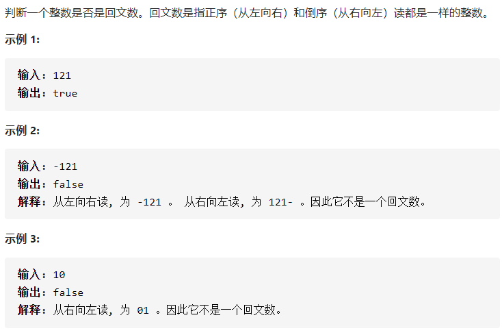

## 回文数




- 解答

  1、原来数字转化为字符串 String

  2、把原数字每一位取出来（从最低位一位一位取），拼接到StringBuffer

  3、原数字与颠倒之后的数字（String 与 StringBuffer.String ）如果一样，说明是回文数

  ```java
  class Solution {
      public boolean isPalindrome(int x) {
          if(x<0)return false;
          if(x<10)return true;
          String a=(new Integer(x)).toString();
          StringBuffer b=new StringBuffer();
          while(x>0){
              b.append(x%10);
              x/=10;
          }
          if(a.equals(b.toString()))return true;
          else return false;
  
      }
  }
  ```

  