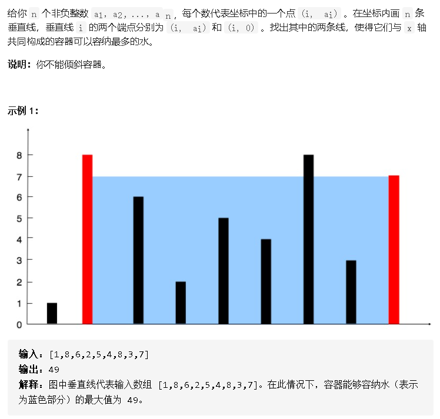
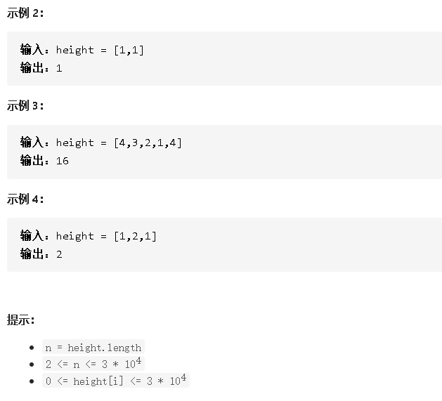
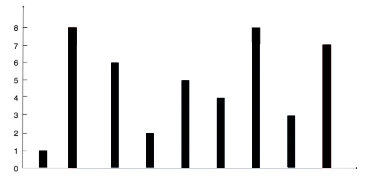

## 11 盛水最多的容器





### 思路

1. 使用双指针 left 和 right。
2. 如果左边小，判断 left 和 right 之间区域是否为最大。并且 left  右移。
3. 如果右边小，判断 left 和 right 之间区域是否为最大。并且 right  左移。
4. 当left right 重叠的时候（相等），结束循环。
5. 一次循环中，因为只移动高度较低的那个指针，从而保留了高度较大的那个。



### 代码

```java
class Solution {
    public int maxArea(int[] height) {
        int left = 0,right = height.length - 1;
        int maxArea = 0;
        while(left < right){
            if(height[left] == min(height[left],height[right])){
                if(height[left]*(right-left)>maxArea)maxArea = height[left]*(right-left);
                left++;
            }else{
                if(height[right]*(right-left)>maxArea)maxArea = height[right]*(right-left);
                right--;
            }
        }
        return maxArea;
    }
    private int min(int a,int b){
        return a<b?a:b;
    }
}
```

