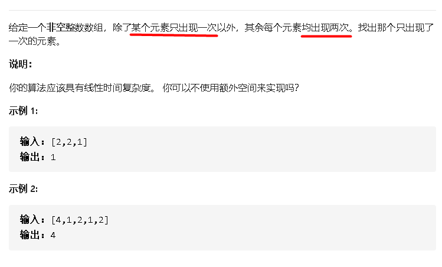

## 136只出现一次的数字



### 思路1

- HashSet 记录解法，使用集合记录下出现过的数字。
  - 遍历数组：如果集合中包含 num[i]则把集合中的该数字移去 ；如果集合中没有 nums[i] 则 Add。
  - 遍历结束，HashSet 里只剩下要找的那个数。
  - 

### 代码1

```java
class Solution {
    public int singleNumber(int[] nums) {
        HashSet<Integer> set = new HashSet<Integer>();
        
        for(int i = 0;i < nums.length;i++){
            if(set.contains(nums[i]))set.remove(nums[i]);
            else set.add(nums[i]);
        }
        int result = -1;
        for(Integer r : set){
            result=r;
        }
        return result;
    }
    
}
```


### 思路2

- hashSet 去重解法
  - 把nums中的每个元素加入 set,因为set中不能有重复元素，所以相当于去重。
  -  set 的所有元素累加的2倍 - nums所有元素累加，即是要找元素。（题中条件：只有一个单独元素，其余的都出现2次）

### 代码2

```java
class Solution {
    public int singleNumber(int[] nums) {
        HashSet<Integer> set = new HashSet();
        for(int i : nums){
            set.add(i);
        }
        int sumSet = 0,sumArray=0;
        for(int i : set){
            sumSet += i;
        }
        for(int i :nums){
            sumArray += i;
        }
       
        return sumSet*2-sumArray;
    }
    
}
```


### 思路3

- 异或 
  - 0 ^ n = n 
  - n ^ n = 0 相同为0
  - a^b^c=a^c^b 交换率
- 一开始a = 0
- 例如
  - [1,3,4,2,3,2,4]：0^1^3^4^2^3^2^4 = 0^3^3^4^4^2^2^1=0^1=1

### 代码3

```java
class Solution {
    public int singleNumber(int[] nums) {
        int a = 0;
        for(int num :nums){
            a^=num;
        } 
        return a;
    }  
}
```

