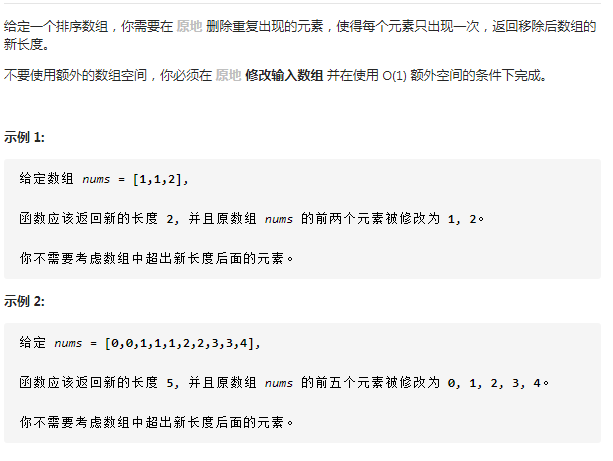

## 26 删除数组中的重复项



### 思路

1. 设定一个 curNum 是记录当前数字
2. 设定一个 cur 指向 已经排列的部分的末端

 

### 代码

```java
class Solution {
    public int removeDuplicates(int[] nums) {
        int n = nums.length;
        if(n == 0)return 0;
        int curNum = nums[0];		//标志着遍历在当前数字
        int cur = 0;				//已经重新排列好的尾部的index
        for(int i = 0; i < n; i++){
            if(nums[i] != curNum){  //遇见了与记录中的数字不一致的
                cur++;				//尾部后移，相当于对已排列部分扩容
                nums[cur] = nums[i];//把新的数字拼接在后面
                curNum = nums[cur];	//更新当前num
            }
        }
        return cur+1;//结果长度，即是 cur+1
    }
}
```

时间复杂度O(n)

空间复杂度O(1)