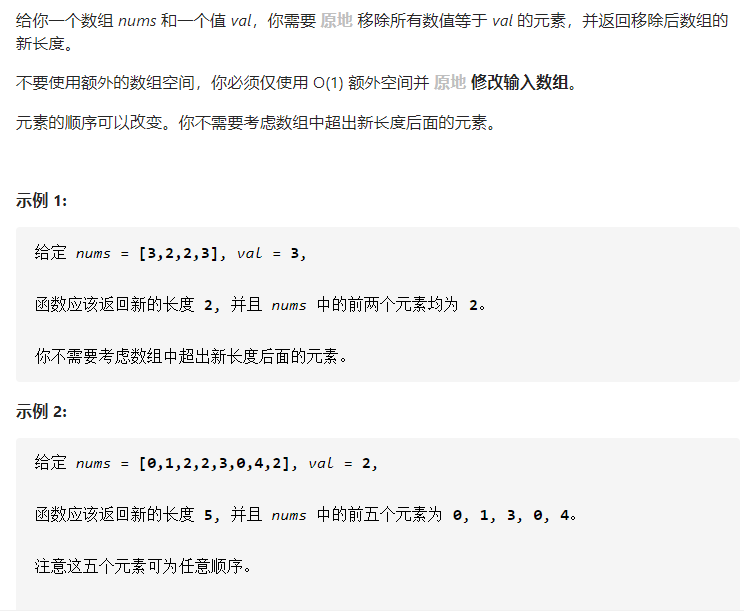
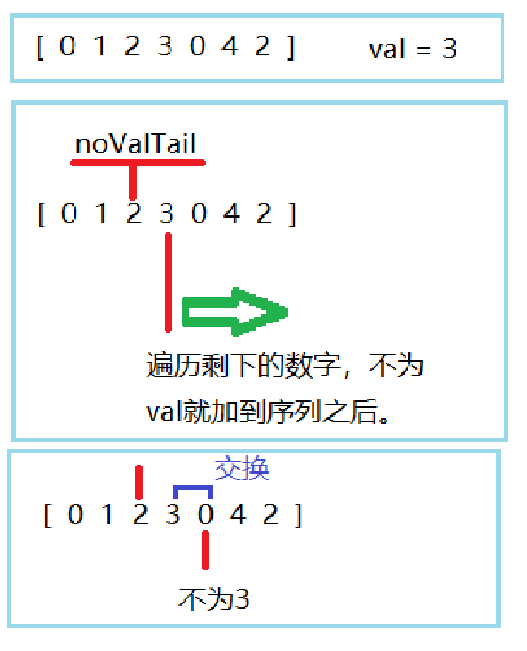

## 27.移除元素



### 思路

1、设定一个索引 noValTail，指向不包含目标数字 val 的序列的尾部。

2、遍历这个序列后面部分，如果也是非目标数字，就加到序列的后面（和序列的后一个数字交换），相应的noValTail 要加1，表示序列扩容。



### 代码

```java
class Solution {
    public int removeElement(int[] nums, int val) {
       int n = nums.length;
       if(n == 0)return 0;
       int noValTail = -1;			//序列初始是空，尾部索引为-1
       for(int i = 0; i < n; i++){
           if(nums[i] == val)break;
           noValTail++;
       }
       if(noValTail == n-1)return n;//未出现目标数字

       for(int i = noValTail + 1; i < n; i++){
           if(nums[i] != val){
               swap(nums,i,++noValTail);//序列扩容，并且把新的数填进来
           }
       }
       return noValTail+1;
    }
    
    private void swap(int[] nums, int i, int j){
        int temp;
        temp = nums[i];
        nums[i] = nums[j];
        nums[j] = temp;
    }
}
```

