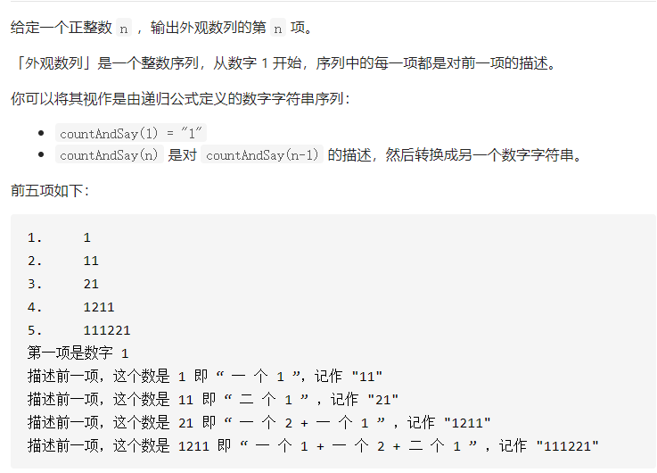

## 38.外观数列



### 思路

1、对一个长度大于1的z字符串，进行计数。

​	使用长度为10的数组 nums 进行计数，下标对应数字，值对应该数字出现的次数。

2、每次遇到数字有变化时（比如1变2、2变4等等情况），需要把对应的数字与个数添加到 stringbuffer 里面，并且对 nums 数组进行排查与清空。

3、遍历结束还需要对 nums 进行一次复盘。

### 代码

```java
class Solution {
   
    public String countAndSay(int n) {
        String s = new String("1");
        if(n == 1)return s;
        for(int i = 0; i < n-1; i++){
            s = say(s);//从String("1")的基础情况，递推
        }
        return s;
    }
    private String say(String s){
        int []nums = new int [10];
        char inChar = ' ';
        StringBuffer numStrBuff = new StringBuffer();
        for(int i = 0; i < s.length(); i++){
            char c = s.charAt(i);
            if(inChar == c){
                nums[c-'0']++;
            }else{
                inChar = c;
                for(int j = 0; j < 10; j++){
                    if(nums[j]!=0){
                        numStrBuff.append(nums[j]);
                        numStrBuff.append(j);
                        nums[j]=0;
                    }
                }
                i--;
            }
        }
        for(int j = 0; j < 10; j++){
            if(nums[j]!=0){
                numStrBuff.append(nums[j]);
                numStrBuff.append(j);
                nums[j]=0;
            }
        }
        return numStrBuff.toString();
    }
}
```

