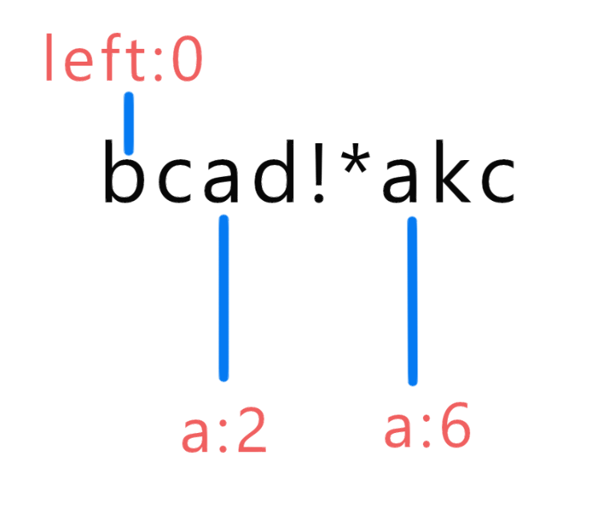

## 3.无重复字符的最长子串


- `0 <= s.length <= 5 * 104`
- `s` 由英文字母、数字、符号和空格组成

### 解答



1、数组 indexs 存放一种字符对应在字符串里的下标，比如第一次碰到a 就是在s 的位置2,a的ascll 是97，所以，indexs[97]=2 。未遇见字符 a  时 indexs[97] 是 -1。

2、遍历 s

- 若在 indexs  查到 值为 -1，说明未遇见，这时把下标存进 indexs
- 若在 indexs 查到了，即为上一次出现的地方的下标。比如上图，一开始a(97)对应存的是2。后来 i=6时，查到 2。这时因为 left 在 2 的左边，所以需要把 left 移动到2的右边。

### 代码

```java
class Solution {
    public int lengthOfLongestSubstring(String s) {
        int count=0;
        int maxCount=0;
        int indexs[] = new int [256];

        for(int i = 0;i<256;i++){
            indexs[i] = -1;
        }
        int left = 0;

        for(int i=0,j=0;i<s.length();i++){
                
            //未有出现
            if(indexs[s.charAt(i)]==-1){
             indexs[s.charAt(i)] = i;
            }
            //出现过
            else{
                if(indexs[s.charAt(i)]+1>left)		//与当前重复字符的字符在子串右边时，才需要改变子串的头
                    left = indexs[s.charAt(i)]+1;
                indexs[s.charAt(i)]=i;
            }
           
            count = i-left+1;
            if(count > maxCount)maxCount = count;
            if(maxCount == 256)return 256;		 //因为无重复，所以最多就256，马上返回减少计算量
        }
        return maxCount;
    }
}
```

