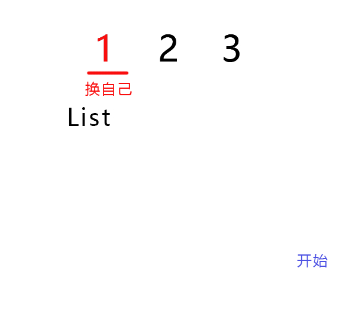

## 46 全排列

### 思路

1. 递归调用

   交换、递归 i 右边部分（ i+1 到 j）、再交换回来。

   其中 i 代表当前遍历到的位置，k 代表从 i  开始要交换的目标，j 代表右端（是不变的，length - 1）。 

2. 当 i==j 时，把序列添加到列表。

- 图解

  

  

### 代码

```java
class Solution {
    List<List<Integer>> seque = new ArrayList<List<Integer>>();
    public List<List<Integer>> permute(int[] nums){
        permuteNums(nums,0,nums.length-1);
        return seque;
    }
    private List<List<Integer>> permuteNums(int[] nums,int i,int j){
        if(i == j){
            List<Integer> tempNums = new ArrayList<Integer>();
            for(int n : nums){
                tempNums.add(n);
            }
            seque.add(tempNums);
            return seque;
        }
        for(int k = i; k <= j; k++){
            swap(nums,i,k);
            permuteNums(nums,i+1,j);
            swap(nums,i,k);
        }
        return seque;
    }
    private void swap(int[] nums,int a,int b){
        int t = nums[a];
        nums[a]=nums[b];
        nums[b]=t;
    }
}
```

