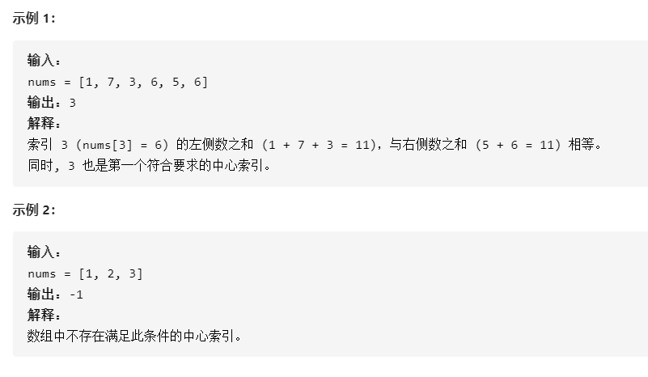

### 寻找数组中心索引

给定一个整数类型的数组 nums，请编写一个能够返回数组 “中心索引” 的方法。

我们是这样定义数组 中心索引 的：数组中心索引的左侧所有元素相加的和等于右侧所有元素相加的和。

如果数组不存在中心索引，那么我们应该返回 -1。如果数组有多个中心索引，那么我们应该返回最靠近左边的那一个。



- 解答

  1、数组求和得到 sum

  2、遍历数组，一次遍历中把左边的数累加，记录在 leftSum 中。右边的和就是 sum-leftsum-nums[i] ，nums[i] 是当前正遍历到的数字。

```java
class Solution {
    public int pivotIndex(int[] nums) {
        if(nums.length==0)return -1;
        if(nums.length==1)return 0;
        int sum=0,leftSum=0;
        for(int x:nums)sum+=x;
        for(int i=0;i<nums.length;i++){
            if(sum-leftSum-nums[i] == leftSum)return i;
            leftSum+=nums[i];
        }
        return -1;
    }
}
```


作者：力扣 (LeetCode)
链接：https://leetcode-cn.com/leetbook/read/array-and-string/yf47s/
来源：力扣（LeetCode）