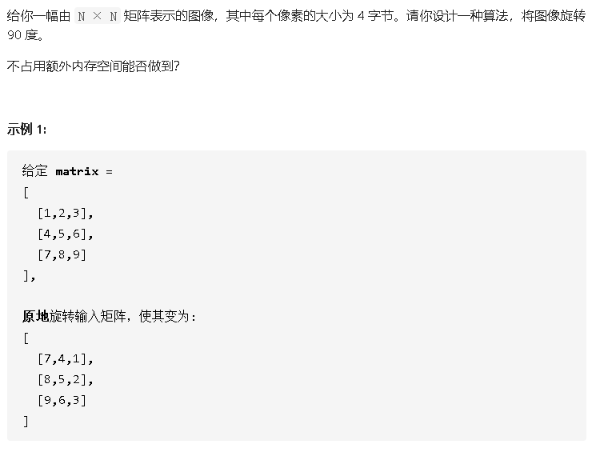

## 旋转矩阵



### 思路

- 上下翻转

  遍历每一列，上下两个互换（双指针向中间靠拢）

- 转置

### 代码

```java
class Solution {
    public void rotate(int[][] matrix) {
        int n = matrix.length;
        int temp;
        //先上下翻转
        for(int i = 0;i < n;i++){
            for(int j = 0, k = n-1; j < k; j++, k--){
                temp = matrix[j][i];
                matrix[j][i] = matrix[k][i];
                matrix[k][i] = temp;
            }
        }
        //再转置
        for(int i = 1;i < n;i++){
            for(int j = 0;j<i;j++){
                temp = matrix[i][j];
                matrix[i][j] = matrix[j][i];
                matrix[j][i] = temp;
            }
        }
    }
}
```

