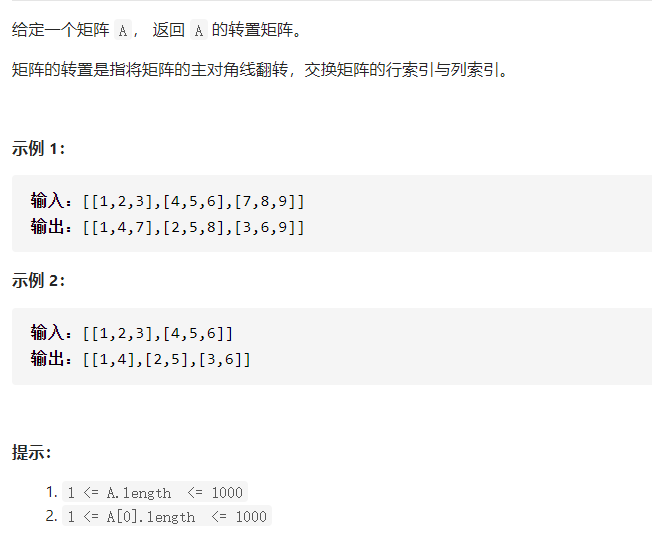

### 转置矩阵



- 解答

  1、对于方阵，只需以左下三角为基准来对换 A\[i][j] 和 A\[j][i]。

  2、对于非方阵，需要新建空间，B\[width][height],然后B\[i][j] = A\[i][j]。

  ```java
  class Solution {
      public int[][] transpose(int[][] A) {
          int height = A.length;
          int width = A[0].length;
          if(height == 0)return new int[0][0];
          int t;
  
          if(height == A[0].length){
              for(int i = 1;i < height; i++){
                  for(int j=0;j<i;j++){
                  t = A[i][j];
                  A[i][j] = A[j][i];
                  A[j][i] = t;  
                  }
              }
              return A;
          }
          int [][]B = new int[width][height];
          for(int i = 0;i<width;i++){
              for(int j = 0;j<height;j++){
                  B[i][j]=A[j][i];
              }
          }
          return B;
      }
  }
  ```

  

  #### 简约快速的方法(建议使用)

  直接复制

  ```java
  class Solution {
      public int[][] transpose(int[][] A) {
          int [][]B = new int[A[0].length][A.length];
          for(int i = 0;i<A[0].length;++i){
              for(int j = 0;j<A.length;++j){
                  B[i][j]=A[j][i];
              }
          }
          return B;
      }
  }
  ```

  