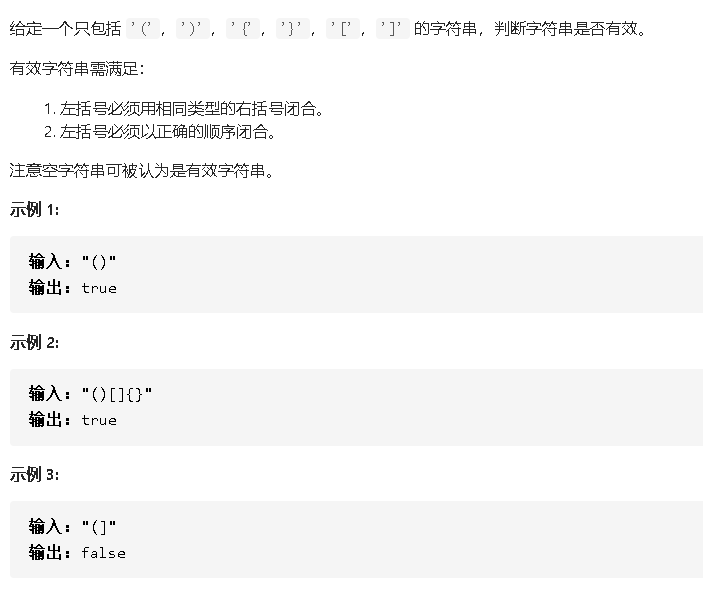

## 20有效括号



### 思路

1、使用栈 ,遍历字符串

- 如果当前字符是 右括号，就去检查栈，（栈为空（当前右括号，栈中空，说明不匹配了）或者栈顶和当前字符是不匹配，返回false）。如果有幸不返回，说明匹配正确，那么需要把栈顶弹出。
- 如果当前字符是左括号，就入栈。

2、结果栈为空，说明匹配成功；栈非空，说明有字符没有匹配成功。

### 代码

```java
class Solution {
    public boolean isValid(String s) {
        Stack<Character> stack = new Stack<Character>();
        
        HashMap<Character,Character> map = new HashMap<Character,Character>();
        map.put('[',']');
        map.put('(',')');
        map.put('{','}');
        if(s.length() == 0)return true;
        if((s.length())%2 != 0)return false;
        
        for(int i = 0;i < s.length(); i++){
            char c = s.charAt(i);
            if(c == ')' || c == ']' || c== '}'){
               //不匹配
               if(stack.empty() || map.get(stack.peek())!=c){
                   return false;
               }
               //有幸不返回，说明当前 c 和 栈顶 匹配正确
               stack.pop();
            }else{
                stack.push(c);
            }
        }

        return stack.empty();
        
    }
}
```

