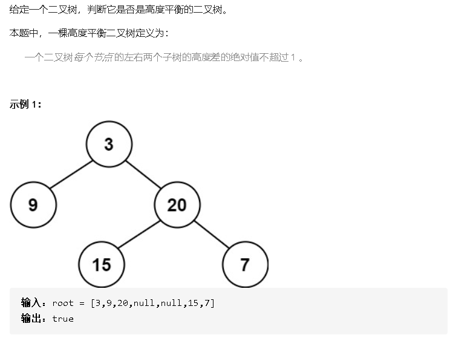
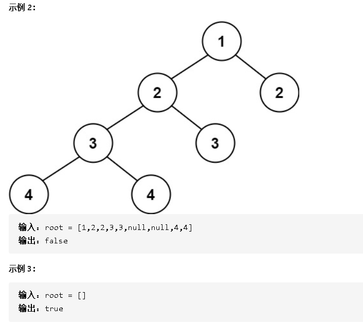

### 110 平衡二叉树






- 解答

  1、travel函数是递归（左、右）获取当前结点的高度。

  2、一个结点平衡的条件是：左子树和右子树高度差小于2，并且左子树平衡，并且右子树平衡。

  ```java
  /**
   * Definition for a binary tree node.
   * public class TreeNode {
   *     int val;
   *     TreeNode left;
   *     TreeNode right;
   *     TreeNode() {}
   *     TreeNode(int val) { this.val = val; }
   *     TreeNode(int val, TreeNode left, TreeNode right) {
   *         this.val = val;
   *         this.left = left;
   *         this.right = right;
   *     }
   * }
   */
  class Solution {
      public boolean isBalanced(TreeNode root) {
          if(root == null)return true;
          int leftHeight = travel(root.left);
          int rightHeight = travel(root.right);
          return Math.abs(leftHeight - rightHeight)<2 && isBalanced(root.left) && isBalanced(root.right);
      }
      //获取当前结点高度
      private int travel(TreeNode root){
          if(root == null){
              return 0;
          }
          return max(travel(root.left),travel(root.right))+1;
      }
      private int max(int x,int y){
          return x>y?x:y;
      }
  }
  ```

  