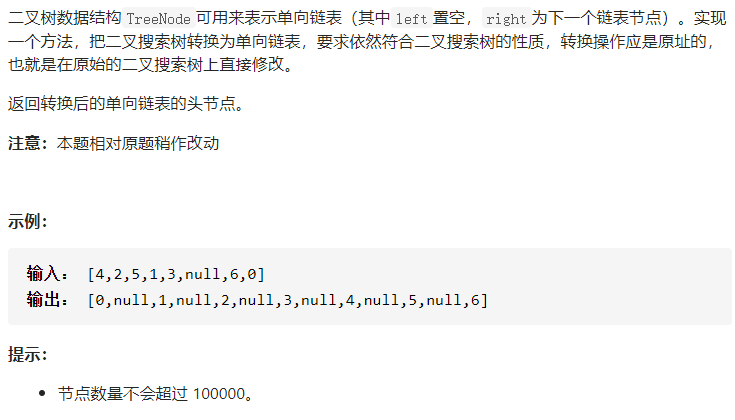

## 17.12BiNode二叉搜索树



### 思路（中序遍历为基础）

二叉搜索树：左边 < root < 右边

1、基础例 root == null 返回 null。

2、root 左边为 null。

	- 访问右边，并且把 root 拼接在右边部分的前面。
	- 返回 root，因为root 没有left ,root 的值就是最小的。

3、root  左边不为 null

- 访问左边，记住左边的头head，因为它的头的值是最小的。
- 把 root 拼接在左边部分的最后。
- 访问右边，把右边部分拼接在 root 后面。

4、返回 head。

### 代码

```java
/**
 * Definition for a binary tree node.
 * public class TreeNode {
 *     int val;
 *     TreeNode left;
 *     TreeNode right;
 *     TreeNode(int x) { val = x; }
 * }
 */
class Solution {
    
    public TreeNode convertBiNode(TreeNode root) {
        if(root == null )return root;

        if(root.left == null){
            root.right = convertBiNode(root.right);//需要访问右边部分！
            return root;
        }

        TreeNode head = convertBiNode(root.left);
        
        TreeNode tail = root.left;
        //找到最右
        while(tail.right != null){
            tail = tail.right;
        }
        tail.right = root;

        root.left = null;

        root.right = convertBiNode(root.right);
        
        return head;
    }
}
```

