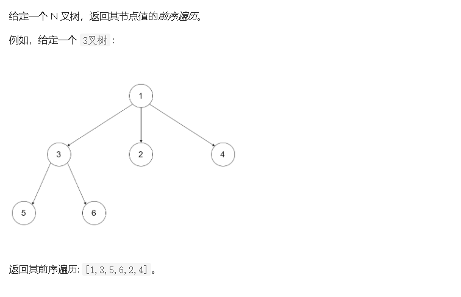

### N叉树的前序遍历



- 解答

  1、先访问当前结点

  2、对当前结点的子结点逐个进行前序遍历。（深度优先）

  ```java
  /*
  // Definition for a Node.
  class Node {
      public int val;
      public List<Node> children;
  
      public Node() {}
  
      public Node(int _val) {
          val = _val;
      }
  
      public Node(int _val, List<Node> _children) {
          val = _val;
          children = _children;
      }
  };
  */
  
  class Solution {
      ArrayList<Integer> nums = new ArrayList<Integer>();
      public List<Integer> preorder(Node root) {
          if(root == null)return new ArrayList<Integer>();//
          nums.add(root.val);
          for(Node child:root.children){//对当前结点的子树逐个前序遍历
              preorder(child);
          }
          return nums;
      }
  }
  ```

  使用迭代的解法(耗时很长)

  1、使用一个栈。

  2、先访问当前结点，添加值到 nums 中。

  3、把当前结点的所有子结点的**逆序列**入栈。

  4、只要栈不为空，重复2、3步骤。

  ```java
  /*
  // Definition for a Node.
  class Node {
      public int val;
      public List<Node> children;
  
      public Node() {}
  
      public Node(int _val) {
          val = _val;
      }
  
      public Node(int _val, List<Node> _children) {
          val = _val;
          children = _children;
      }
  };
  */
  
  class Solution {
      ArrayList<Integer> nums = new ArrayList<Integer>();
      public List<Integer> preorder(Node root) {
          if(root == null)return new ArrayList<Integer>();
          Node mRoot;
          Stack<Node> children = new Stack<>();
          children.push(root);
          while(!children.empty()){
              mRoot = children.pop();
              nums.add(mRoot.val);
              Collections.reverse(mRoot.children);
              for(Node child:mRoot.children){
                  children.push(child);
              }
          }
          
          return nums;
      }
  }
  ```

  