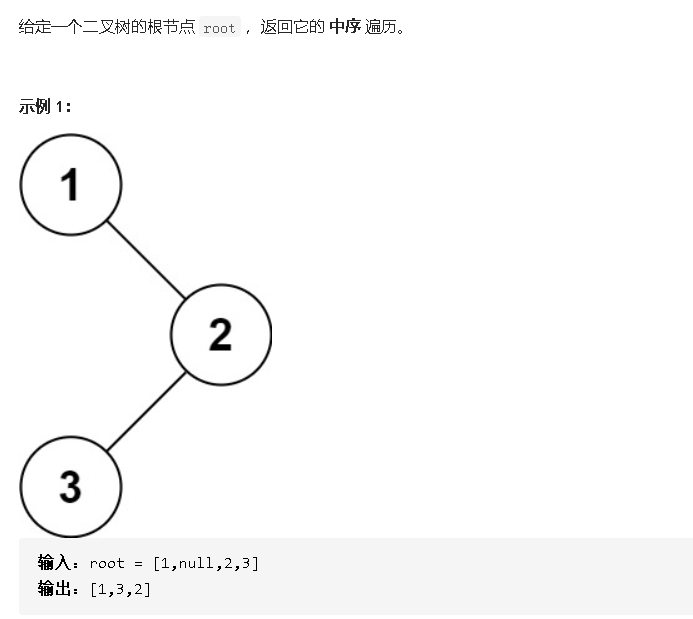

## 二叉树的中序遍历



- 解答

  ```java
  /**
   * Definition for a binary tree node.
   * public class TreeNode {
   *     int val;
   *     TreeNode left;
   *     TreeNode right;
   *     TreeNode() {}
   *     TreeNode(int val) { this.val = val; }
   *     TreeNode(int val, TreeNode left, TreeNode right) {
   *         this.val = val;
   *         this.left = left;
   *         this.right = right;
   *     }
   * }
   */
  class Solution {
      private List<Integer> nums = new ArrayList<Integer>();
      public List<Integer> inorderTraversal(TreeNode root) {
          if(root == null)return new ArrayList<Integer>();    //如果当前结点空，那么不做操作
          inorderTraversal(root.left);                        //遍历左
          nums.add(root.val);                                 //访问当前
          inorderTraversal(root.right);                       //遍历右
          return nums;
      }
  
  }
  ```

  

