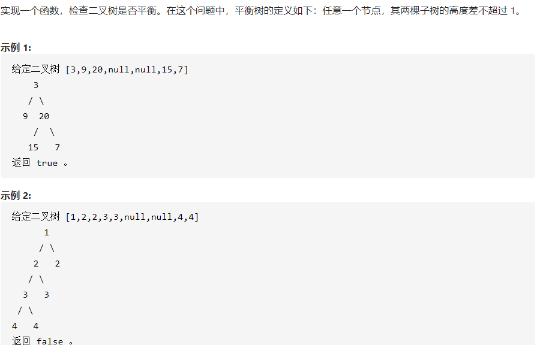

## 04.04. 检查平衡性

```java
/**
 * Definition for a binary tree node.
 * public class TreeNode {
 *     int val;
 *     TreeNode left;
 *     TreeNode right;
 *     TreeNode(int x) { val = x; }
 * }
 */
class Solution {
    boolean balance = true;
    public boolean isBalanced(TreeNode root) {
        height(root);
        return balance;
    }
    public int height(TreeNode root){
        if(root == null)return 0;
        if(root.left == null && root.right == null)return 1;
        int left = height(root.left)+1;
        int right = height(root.right)+1;
        int max = Math.max(left,right);
        if(Math.abs(left-right)>1)balance = false;
        return max; 
    }
}
```

## 思路

- 左右子树高度差不超过1，即为平衡。
- 当前结点高度
  - 空：0
  - 左右子树都为空：说明是叶子结点，1
- 左子树高度：height(root.left)+1
- 右子树高度：height(root.right)+1
- 当前结点高度：
  - 左子树和右子树中，较大的一个。


