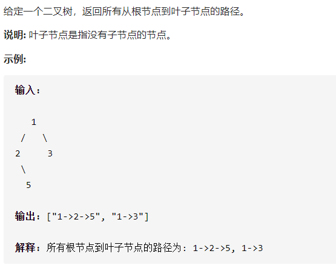

## 257.二叉树的所有路径

```java
/**
 * Definition for a binary tree node.
 * public class TreeNode {
 *     int val;
 *     TreeNode left;
 *     TreeNode right;
 *     TreeNode() {}
 *     TreeNode(int val) { this.val = val; }
 *     TreeNode(int val, TreeNode left, TreeNode right) {
 *         this.val = val;
 *         this.left = left;
 *         this.right = right;
 *     }
 * }
 */
class Solution {
    public List<String> binaryTreePaths(TreeNode root) {
        ArrayList<String> paths = new ArrayList<String>();
        dfs(root,"",paths);
        return paths;
    }
    public void dfs(TreeNode root,String path,ArrayList paths){
        if(root == null){
            return ;
        }
        if(root.left == null && root.right == null){
            paths.add(path + root.val);
            return ;
        }
        dfs(root.left,path + root.val + "->",paths); 
        dfs(root.right,path + root.val + "->",paths);
      
    }
}
```

## 思路

- 当前为 null 返回
- 当前为叶子：把当前结点的值拼接到字符串，结束深搜（path 字符串加到 list 中）。

- 当前非叶子结点并且非空：先搜左边，再搜右边。（path 为 path + root.val + "->" ,代表访问了当前结点）

