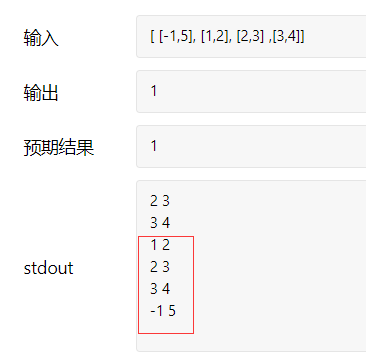

### 435 无重叠区间

- 代码

  ```java
  import java.util.Arrays;
  class Solution {
      public int eraseOverlapIntervals(int[][] intervals) {
          Arrays.sort(intervals,new Comparator<int[]>(){
              @Override
              public int compare(int[] o1,int[] o2){
                  return (o1[1]<o2[1])?-1:((o1[1]==o2[1])?0:1);//比较第二个元素，小的排前面。
              }
          });
          int rows = intervals.length;
          if(rows == 0)return 0;
          int cols = intervals[0].length;
  
          int end = intervals[0][1];
          int count = 1;//计区间总数
          
          for(int[] seg : intervals){
             if(seg[0] < end)continue;
             end = seg[1];
             //System.out.println(seg[0]+" "+seg[1]);
             count++;
          }
          
          // for(int i = 0; i < rows; i++){
          //     for(int j = 0; j < cols; j++){
          //         System.out.print(intervals[i][j]+" ");
          //     }
          //     System.out.println();
          // }
          //return 0;
          return rows - count;
      }
  }
  
  ```

  

- 


