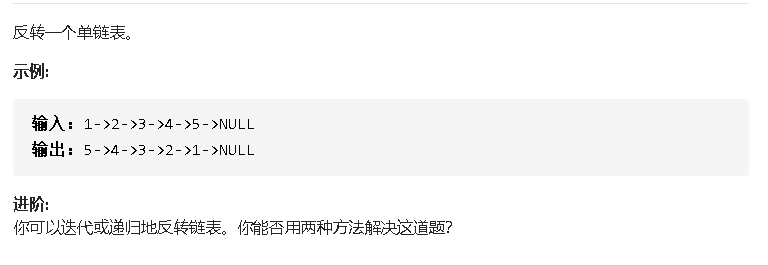

## 206  反转链表



### 思路

1、前两个结点特殊处理，第一个结点作为pre

2、从第二个结点开始：只要nextOne不空，就把它作为头，并且记录剩下的部分；把pre加到head后面之后，更新pre

### 代码

```java
/**
 * Definition for singly-linked list.
 * public class ListNode {
 *     int val;
 *     ListNode next;
 *     ListNode(int x) { val = x; }
 * }
 */
class Solution {
    public ListNode reverseList(ListNode head) {
        ListNode nextOne,nextNext,pre;
        
        if(head == null)return null;
        
        nextOne = head.next;

        head.next = null;

        pre = head;
         
        while(nextOne != null){
            head = nextOne;
            
            nextOne = head.next;

            head.next = pre;
            
            pre = head;
        }

        return head;
    }
}
```

